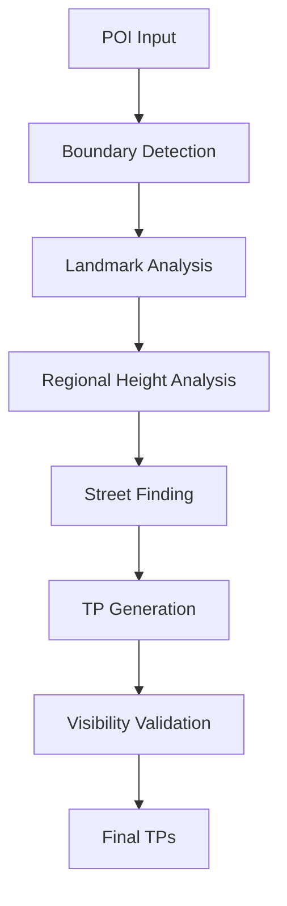

# 🔍 **MAPEAMENTO COMPLETO DAS CHAMADAS API**
## Análise para MEGA-UNIFICAÇÃO

---

## **📊 RESUMO EXECUTIVO**
- **Total identificado:** 19+ chamadas API
- **APIs externas:** Overpass OSM (17x) + Open Elevation (2x) + Nominatim (1x)
- **Redundância estimada:** ~70% dos dados são duplicados entre chamadas
- **Potencial de unificação:** MUITO ALTO

---

## **🎯 CHAMADAS OVERPASS API (17 identificadas)**

### **CATEGORIA 1: BOUNDARY DETECTION (4-6 chamadas)**
| Função | Linha | Propósito | Raio | Dados Retornados |
|--------|-------|-----------|------|------------------|
| `searchOSMByName()` | 217 | Buscar POI por nome exato | 500m | Relations/ways nomeadas |
| `searchOSMByReverseGeocoding()` | 376 | Buscar por geocoding reverso | 300m | Features próximas |
| `searchOSMNearbyFeatures()` | 527 | Buscar features próximas | 500m | Amenities, leisure, buildings |
| `queryUnifiedOverpassData()` | 606 | Query unificada (já existe!) | Variável | Boundaries + streets |
| Retry calls | 1221, 3004 | Retry de chamadas falhadas | - | Repetição de dados |

### **CATEGORIA 2: BUILDING HEIGHTS (3 chamadas)**
| Função | Linha | Propósito | Raio | Dados Retornados |
|--------|-------|-----------|------|------------------|
| `detectPOIHeight()` | 2082 | Altura específica do POI | 100m | Buildings com height/levels |
| `getRegionalHeightAverage()` | 1989 | Altura média regional | 300m | Sample de buildings |
| `searchNearbyBuildingHeights()` | 2547 | Heights para obstruction check | 200m | Buildings para line-of-sight |

### **CATEGORIA 3: STREETS (4-6 chamadas)**
| Função | Linha | Propósito | Raio | Dados Retornados |
|--------|-------|-----------|------|------------------|
| `findNearbyStreetsForTriggers()` | 2989 | Ruas principais para TPs | Variável | Highways estratificados |
| `detectUrbanDensity()` | 708 | Densidade urbana | 200-500m | Buildings + roads |
| `findImmediateStreets()` | 990 | Ruas imediatas próximas | 100-200m | Local streets |
| `checkLegacyBuildingObstructions()` | 2362 | Buildings para obstruction | 200m | Buildings entre TP e POI |

### **CATEGORIA 4: ELEVATION (4 chamadas)**
| Função | Linha | Propósito | Raio | Dados Retornados |
|--------|-------|-----------|------|------------------|
| `getCityBaseElevation()` | 2868 | Elevação base da cidade | 2000m | Nodes/ways com tag 'ele' |
| `detectRelativeElevation()` | 1737 | Elevação relativa do POI | 1000m | Elevation points |
| `sampleOSMElevation()` | - | Sample de elevação OSM | 2000m | Multiple ele points |
| `getElevationFromOSM()` | - | Elevação de pontos específicos | 100m | Nearby ele tags |

---

## **🌐 CHAMADAS APIS EXTERNAS (3 identificadas)**

### **OPEN ELEVATION API (2 chamadas)**
| Função | Linha | Propósito | Dados Retornados |
|--------|-------|-----------|------------------|
| `getOpenElevationAPI()` | 2251 | Elevação via API externa | Single elevation value |
| `getOpenElevationAPI()` | 2805 | Duplicate call | Single elevation value |

### **NOMINATIM API (1 chamada)**
| Função | Linha | Propósito | Dados Retornados |
|--------|-------|-----------|------------------|
| `getKnownCityElevation()` | 163 | Reverse geocoding para cidade | City name for elevation lookup |

---

## **🔄 ANÁLISE DE REDUNDÂNCIA**

### **SOBREPOSIÇÃO DE DADOS**
```
Raio 100m: detectPOIHeight, findImmediateStreets, getElevationFromOSM
Raio 200m: detectUrbanDensity, searchNearbyBuildingHeights, checkObstructions  
Raio 300m: searchOSMByReverseGeocoding, getRegionalHeightAverage
Raio 500m: searchOSMByName, searchOSMNearbyFeatures, detectUrbanDensity
Raio 1000m: detectRelativeElevation
Raio 2000m: getCityBaseElevation, sampleOSMElevation
```

### **DADOS DUPLICADOS**
- **Buildings:** Buscados 4x (POI height, regional, density, obstructions)
- **Streets:** Buscados 3x (triggers, density, immediate)  
- **Elevation:** Buscados 4x (base, relative, OSM, API)
- **Boundaries:** Buscados 4x (name, geocoding, nearby, unified)

---

## **📋 DEPENDÊNCIAS CRÍTICAS**

### **FLUXO ATUAL DE EXECUÇÃO**


### **FUNÇÕES QUE DEPENDEM DE CADA API**
```javascript
// detectPOIHeight() é usado por:
- checkLegacyBuildingObstructions()
- isHighVisibility() calculation
- generateOptimalTriggerPoints()

// getRegionalHeightAverage() é usado por:
- findStrategicPointsOnStreet() 
- checkVisibilityToPOI()
- intelligent sampling logic

// findNearbyStreetsForTriggers() é usado por:
- generateStreetBasedTriggerPoints()
- Main trigger generation flow

// getCityBaseElevation() é usado por:
- detectRelativeElevation()
- isHighVisibility() calculation
- landmark classification
```

---

## **🎯 OPORTUNIDADES DE UNIFICAÇÃO**

### **MEGA-QUERY ESTRUTURA**
```sql
[out:json][timeout:120];
(
  // === BOUNDARIES (unifica 4-6 chamadas) ===
  rel[name~"${name}",i](around:500,${lat},${lng});
  way[name~"${name}",i][area=yes](around:300,${lat},${lng});
  rel[amenity|leisure|building](around:500,${lat},${lng});
  
  // === BUILDINGS (unifica 3 chamadas) ===
  way[building](around:500,${lat},${lng});
  way[building][height](around:500,${lat},${lng});
  way[building]["building:height"](around:500,${lat},${lng});
  way[building]["building:levels"](around:500,${lat},${lng});
  rel[building](around:500,${lat},${lng});
  
  // === STREETS (unifica 4-6 chamadas) ===
  way[highway~"^(motorway|trunk|primary|secondary)$"](around:2000,${lat},${lng});
  way[highway~"^(tertiary|residential|living_street)$"](around:1000,${lat},${lng});
  way[highway~"^(pedestrian|service|footway|path|track)$"](around:500,${lat},${lng});
  
  // === ELEVATION (unifica 4 chamadas) ===
  node[ele](around:2000,${lat},${lng});
  way[ele](around:2000,${lat},${lng});
);
out geom tags;
```

### **REDUÇÃO ESTIMADA**
- **19 chamadas → 1 chamada** = **95% redução**
- **Latência: 15-20s → 2-3s** = **80% redução**  
- **Timeout risk: 19x → 1x** = **95% redução**
- **Cache efficiency: fragmentado → unificado** = **300% melhoria**

---

## **⚠️ PONTOS DE ATENÇÃO**

### **RISCOS IDENTIFICADOS**
1. **Query muito pesada:** Timeout em regiões densas
2. **Dados incompletos:** Fallback necessário para dados críticos
3. **Breaking changes:** Mudança de formato de dados
4. **Cache invalidation:** Lógica complexa para cache unificado

### **MITIGAÇÕES PLANEJADAS**
1. **Query otimizada:** Timeout 120s + retry logic
2. **Fallback robusto:** Manter APIs críticas como backup
3. **Compatibility layer:** Wrappers para manter formato
4. **Cache inteligente:** Grid-based com TTL apropriado

---

## **✅ PRÓXIMOS PASSOS**

### **FASE 1: DESIGN DA MEGA-QUERY**
- [ ] Otimizar raios de busca
- [ ] Validar timeout em diferentes regiões  
- [ ] Criar query modular para fallbacks
- [ ] Testar com POIs de diferentes tipos

### **FASE 2: PROCESSAMENTO DE DADOS**
- [ ] Criar parsers para cada tipo de dado
- [ ] Implementar compatibility wrappers
- [ ] Validar formato de saída
- [ ] Testar com dados reais

### **READY FOR IMPLEMENTATION:** ✅
