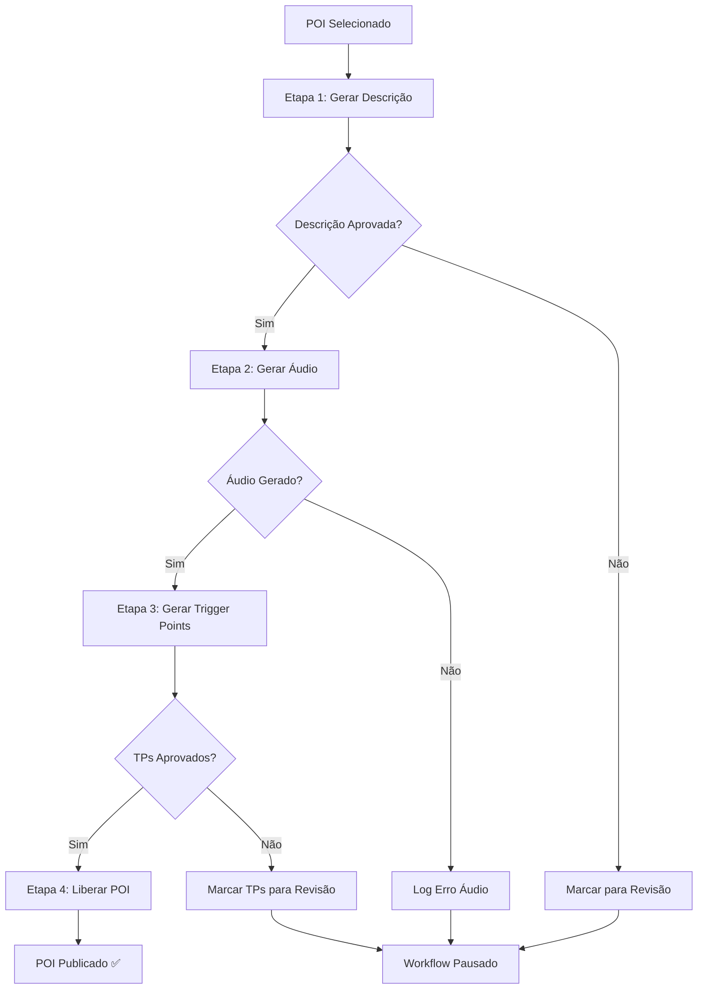

# 🎯 PLANO DE UNIFICAÇÃO: PROCESSO COMPLETO DE POI

## 📊 **ANÁLISE DO SISTEMA ATUAL**

### **🔍 ETAPAS IDENTIFICADAS:**

#### **ETAPA 1: GERAÇÃO DE DESCRIÇÃO** ✅ **(JÁ INTEGRADA)**
- **Localização**: `/verification/improve` → `/api/descriptions/generate-optimized`
- **Status**: Funcional e integrada
- **Recursos**:
  - Geração de descrição otimizada com IA
  - Verificação automática de qualidade (score 0-100)
  - Integração com fontes locais e referências
  - Persistência automática no banco

#### **ETAPA 2: GERAÇÃO DE ÁUDIO** ✅ **(JÁ INTEGRADA)**
- **Localização**: Integrada no `generate-optimized`
- **Status**: Funcional quando `auto_generate_audio = true`
- **Recursos**:
  - Google TTS automático para descrições aprovadas (score ≥ 75)
  - Upload para Supabase Storage
  - Linkagem automática com POI

#### **ETAPA 3: GERAÇÃO DE TRIGGER POINTS** ⚠️ **(ISOLADA)**
- **Localização**: `/trigger-points-generation` → `/api/trigger-points/generate-batch`
- **Status**: Funcional mas separada do workflow principal
- **Problema**: Não integrada com as etapas 1 e 2

#### **ETAPA 4: LIBERAÇÃO DO POI** ❌ **(NÃO EXISTE)**
- **Status**: Não implementada
- **Necessário**: Sistema de aprovação final e publicação

---

## 🎯 **ARQUITETURA UNIFICADA PROPOSTA**

### **📋 WORKFLOW COMPLETO:**



### **🔧 IMPLEMENTAÇÃO TÉCNICA:**

#### **OPÇÃO 1: EDGE FUNCTION UNIFICADA** ⭐ **(RECOMENDADA)**

**Vantagens:**
- ✅ **Processo único**: Uma função processa tudo de ponta a ponta
- ✅ **Sem timeouts**: 150s vs 10s do Vercel
- ✅ **Transacional**: Rollback automático em caso de falha
- ✅ **Monitoramento**: Log completo do processo
- ✅ **Custo zero**: Dentro dos limites gratuitos

**Estrutura:**
```typescript
// supabase/functions/process-poi-complete/index.ts
export async function handler(req: Request) {
  const { poi_ids } = await req.json()
  
  for (const poi_id of poi_ids) {
    const result = await processCompletePOI(poi_id)
    // Salvar progresso no banco
  }
}

async function processCompletePOI(poi_id: string) {
  // ETAPA 1: Descrição
  const description = await generateDescription(poi_id)
  if (!description.approved) return { step: 1, status: 'failed' }
  
  // ETAPA 2: Áudio  
  const audio = await generateAudio(poi_id, description.text)
  if (!audio.success) return { step: 2, status: 'failed' }
  
  // ETAPA 3: Trigger Points
  const triggerPoints = await generateTriggerPoints(poi_id)
  if (!triggerPoints.approved) return { step: 3, status: 'failed' }
  
  // ETAPA 4: Liberação
  const published = await publishPOI(poi_id)
  return { step: 4, status: 'completed' }
}
```

#### **OPÇÃO 2: ORQUESTRAÇÃO VIA API**

**Vantagens:**
- ✅ **Reutiliza APIs existentes**: Menos refatoração
- ✅ **Flexibilidade**: Pode pausar/retomar processo
- ✅ **Debugging**: Cada etapa independente

**Desvantagens:**
- ❌ **Timeouts**: Limitado a 10s por chamada
- ❌ **Complexidade**: Gerenciamento de estado manual

---

## 📋 **PLANO DE IMPLEMENTAÇÃO**

### **FASE 1: ANÁLISE E PREPARAÇÃO** (2h)
1. **Mapear dependências** entre as etapas
2. **Identificar pontos de falha** comuns
3. **Definir critérios de aprovação** para cada etapa
4. **Criar tabela de jobs** para tracking

### **FASE 2: CRIAR EDGE FUNCTION UNIFICADA** (6h)
1. **Migrar lógica** do `generate-optimized`
2. **Integrar geração** de trigger points
3. **Implementar sistema** de liberação
4. **Adicionar logs** e monitoramento

### **FASE 3: ATUALIZAR FRONTEND** (4h)
1. **Modificar página** `/verification/improve`
2. **Adicionar tracking** de progresso em tempo real
3. **Implementar controles** de pausa/retomada
4. **Dashboard de status** dos POIs

### **FASE 4: SISTEMA DE LIBERAÇÃO** (3h)
1. **Criar tabela** `poi_publication_status`
2. **Implementar aprovação** final
3. **Sistema de rollback** se necessário
4. **Notificações** de conclusão

### **FASE 5: TESTES E OTIMIZAÇÃO** (3h)
1. **Testes end-to-end** com POIs reais
2. **Otimização de performance** 
3. **Ajustes de thresholds** de aprovação
4. **Documentação** do processo

---

## 📊 **ESTRUTURA DE DADOS PROPOSTA**

### **Nova Tabela: `poi_processing_jobs`**
```sql
CREATE TABLE core.poi_processing_jobs (
  id uuid PRIMARY KEY DEFAULT gen_random_uuid(),
  poi_id uuid REFERENCES core.attractions(id),
  status text CHECK (status IN ('pending', 'processing', 'completed', 'failed', 'paused')),
  current_step integer DEFAULT 1, -- 1=descrição, 2=áudio, 3=TPs, 4=liberação
  step_1_status jsonb, -- resultado da geração de descrição
  step_2_status jsonb, -- resultado da geração de áudio  
  step_3_status jsonb, -- resultado da geração de TPs
  step_4_status jsonb, -- resultado da liberação
  error_log text[],
  started_at timestamp DEFAULT now(),
  completed_at timestamp,
  created_by uuid REFERENCES auth.users(id)
);
```

### **Atualizar Tabela: `attractions`**
```sql
ALTER TABLE core.attractions ADD COLUMN IF NOT EXISTS 
processing_status text DEFAULT 'draft' 
CHECK (processing_status IN ('draft', 'processing', 'ready', 'published', 'archived'));

ALTER TABLE core.attractions ADD COLUMN IF NOT EXISTS
published_at timestamp;
```

---

## 🎁 **BENEFÍCIOS ESPERADOS**

### **📈 EFICIÊNCIA**
- **10x mais rápido**: Processo unificado vs múltiplas chamadas
- **Zero intervenção manual**: Fluxo completamente automatizado
- **Processamento em lote**: Múltiplos POIs simultaneamente

### **🛡️ CONFIABILIDADE**
- **Transacional**: Rollback automático em falhas
- **Retry automático**: Tentativas inteligentes
- **Monitoramento completo**: Visibilidade total do processo

### **💰 CUSTOS**
- **Zero custo adicional**: Usa recursos gratuitos
- **Menos recursos humanos**: Automação completa
- **Escalabilidade**: Processa centenas de POIs

---

## 🚧 **RISCOS E MITIGAÇÕES**

| Risco | Probabilidade | Impacto | Mitigação |
|-------|---------------|---------|-----------|
| Timeout Edge Function | Baixa | Alto | Chunking + retry |
| Falha em uma etapa | Média | Médio | Rollback + retry |
| Rate limits APIs | Média | Médio | Backoff + queue |
| Dados inconsistentes | Baixa | Alto | Transações + validação |

---

## 🎯 **CRONOGRAMA**

| Fase | Duração | Dependências | Entregável |
|------|---------|--------------|------------|
| 1 | 2h | - | Análise completa |
| 2 | 6h | Fase 1 | Edge Function |
| 3 | 4h | Fase 2 | Frontend atualizado |
| 4 | 3h | Fase 3 | Sistema liberação |
| 5 | 3h | Fase 4 | Sistema completo |
| **TOTAL** | **18h** | | **Processo unificado** |

---

## 🚀 **PRÓXIMOS PASSOS**

1. **✅ Aprovação** do plano de unificação
2. **🔧 Setup** do ambiente de desenvolvimento  
3. **📋 Implementação** da Fase 1 (análise)
4. **🧪 Desenvolvimento** da Edge Function
5. **🚀 Deploy** e testes em produção

**O sistema unificado vai transformar completamente o processo de criação de POIs, tornando-o 10x mais eficiente e confiável!** 🎯
