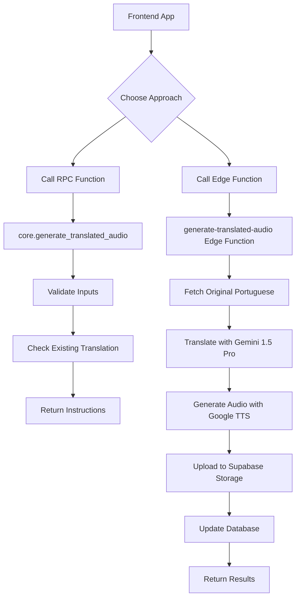

# Generate Translated Audio - Complete Implementation

This document describes the complete implementation of the `generate_translated_audio` feature for the Tuggi CMS, which allows generating translated and narrated versions of POI descriptions.

## 🎯 Overview

The system provides two approaches for generating translated audio:

1. **Edge Function** (Recommended): Handles all external API calls and processing
2. **RPC Function**: Provides SQL interface for validation and coordination

## 🏗️ Architecture



## 🗄️ Database Requirements

### Table Schema

The system requires the `core.attraction_descriptions` table with these columns:

```sql
CREATE TABLE core.attraction_descriptions (
  id uuid PRIMARY KEY DEFAULT gen_random_uuid(),
  attraction_id uuid NOT NULL REFERENCES core.attractions(id),
  language text NOT NULL,
  description text NOT NULL,
  audio_url text,
  gender text NOT NULL DEFAULT 'male',
  play_count integer DEFAULT 0,
  last_played_at timestamp with time zone,
  created_at timestamp with time zone DEFAULT now(),
  updated_at timestamp with time zone DEFAULT now(),
  group_id uuid REFERENCES core.attraction_groups(id),
  UNIQUE(attraction_id, language),
  CHECK (gender IN ('male', 'female'))
);
```

### Migration

Run the database migration to ensure all required columns exist:

```bash
# Apply the schema migration
psql -h your-db-host -d your-database -f supabase/add-audio-url-column.sql
```

Or in Supabase Dashboard:
1. Go to SQL Editor
2. Run the contents of `supabase/add-audio-url-column.sql`

## 🚀 Deployment

### 1. Deploy the Edge Function

```bash
# Deploy the Edge Function
supabase functions deploy generate-translated-audio

# Set environment variables in Supabase Dashboard > Edge Functions > generate-translated-audio > Settings:
# - PROJECT_URL: Your Supabase project URL
# - SERVICE_ROLE_KEY: Your Supabase service role key  
# - GEMINI_API_KEY: Your Google Gemini API key
# - GOOGLE_CLOUD_API_KEY: Your Google Cloud API key
```

### 2. Create the RPC Function

```bash
# Apply the RPC function
psql -h your-db-host -d your-database -f supabase/create-generate-translated-audio-function.sql
```

Or run in Supabase SQL Editor:
```sql
-- Run the contents of supabase/create-generate-translated-audio-function.sql
```

### 3. Setup Storage Bucket

Ensure the `travel-app-audios` bucket exists in Supabase Storage:

1. Go to Storage in Supabase Dashboard
2. Create bucket named `travel-app-audios`
3. Set public read permissions
4. Configure appropriate RLS policies

## 📋 Usage Examples

### Approach 1: Direct Edge Function Call (Recommended)

```javascript
// Frontend/Application Code
async function generateTranslatedAudio(attractionId, targetLanguage, voiceGender) {
  const response = await fetch(
    `${SUPABASE_URL}/functions/v1/generate-translated-audio`,
    {
      method: 'POST',
      headers: {
        'Authorization': `Bearer ${SUPABASE_ANON_KEY}`,
        'Content-Type': 'application/json'
      },
      body: JSON.stringify({
        attractionId,
        targetLanguage,
        voiceGender
      })
    }
  );

  const result = await response.json();
  
  if (result.success) {
    console.log('Audio URL:', result.data.audioUrl);
    console.log('Translated Text:', result.data.translatedText);
    return result.data;
  } else {
    throw new Error(result.error);
  }
}

// Usage
try {
  const result = await generateTranslatedAudio(
    'attraction-uuid-here',
    'en-us',
    'female'
  );
  // Use result.audioUrl and result.translatedText
} catch (error) {
  console.error('Translation failed:', error.message);
}
```

### Approach 2: RPC Function Interface

```sql
-- Direct SQL call (for database operations or stored procedures)
SELECT * FROM core.generate_translated_audio(
  'attraction-uuid-here'::uuid,
  'en-us',
  'female'
);

-- Validation helper
SELECT core.validate_translation_request(
  'attraction-uuid-here'::uuid,
  'en-us', 
  'female'
);
```

```javascript
// Using Supabase client
const { data, error } = await supabase.rpc('generate_translated_audio', {
  p_attraction_id: 'attraction-uuid-here',
  p_target_language: 'en-us',
  p_voice_gender: 'female'
});

// Note: RPC function returns instructions, not actual audio
// You still need to call the Edge Function for actual processing
```

### Approach 3: Hybrid Workflow (Best Practice)

```javascript
// 1. First validate the request using RPC function
const { data: validation } = await supabase.rpc('validate_translation_request', {
  p_attraction_id: attractionId,
  p_target_language: targetLanguage,
  p_voice_gender: voiceGender
});

if (!validation.valid) {
  throw new Error(validation.error);
}

// 2. Check if translation already exists
if (validation.has_existing_audio) {
  console.log('Using existing translation:', validation.existing_translation);
  return validation.existing_translation;
}

// 3. Call Edge Function for new translation
const result = await generateTranslatedAudio(attractionId, targetLanguage, voiceGender);
return result;
```

## 🌍 Supported Languages

| Language | Code | Male Voice | Female Voice |
|----------|------|------------|--------------|
| English (US) | `en`, `en-us` | en-US-Neural2-J | en-US-Neural2-F |
| Spanish (Spain) | `es`, `es-es` | es-ES-Neural2-B | es-ES-Neural2-A |
| French (France) | `fr`, `fr-fr` | fr-FR-Neural2-B | fr-FR-Neural2-A |
| German | `de`, `de-de` | de-DE-Neural2-B | de-DE-Neural2-A |
| Italian | `it`, `it-it` | it-IT-Neural2-C | it-IT-Neural2-A |
| Portuguese (Brazil) | `pt`, `pt-br` | pt-BR-Neural2-B | pt-BR-Neural2-A |

## 🔧 API Reference

### Edge Function API

**Endpoint**: `POST /functions/v1/generate-translated-audio`

**Request Body**:
```json
{
  "attractionId": "uuid",
  "targetLanguage": "en-us",
  "voiceGender": "female"
}
```

**Response**:
```json
{
  "success": true,
  "data": {
    "audioUrl": "https://project.supabase.co/storage/v1/object/public/travel-app-audios/audio/attraction-id/attraction-id-en-us.mp3",
    "translatedText": "Translated description text..."
  }
}
```

### RPC Functions

**Main Function**:
```sql
core.generate_translated_audio(
  p_attraction_id uuid,
  p_target_language text,
  p_voice_gender text
) RETURNS TABLE(audio_url text, translated_text text)
```

**Validation Helper**:
```sql
core.validate_translation_request(
  p_attraction_id uuid,
  p_target_language text, 
  p_voice_gender text
) RETURNS jsonb
```

## 🏪 Storage Structure

Audio files are organized in the `travel-app-audios` bucket:

```
travel-app-audios/
├── audio/
│   ├── attraction-uuid-1/
│   │   ├── attraction-uuid-1-en-us.mp3
│   │   ├── attraction-uuid-1-es-es.mp3
│   │   └── attraction-uuid-1-fr-fr.mp3
│   ├── attraction-uuid-2/
│   │   ├── attraction-uuid-2-en-us.mp3
│   │   └── attraction-uuid-2-de-de.mp3
│   └── ...
```

## 🔐 Security & Permissions

### Environment Variables

Required for Edge Function:
- `GEMINI_API_KEY`: Google Gemini API key
- `GOOGLE_CLOUD_API_KEY`: Google Cloud TTS API key
- `PROJECT_URL`: Supabase project URL
- `SERVICE_ROLE_KEY`: Supabase service role key

### Database Permissions

Both functions are created with `SECURITY DEFINER` and granted to:
- `authenticated`: For app users
- `service_role`: For Edge Functions and admin operations

### Storage Permissions

The `travel-app-audios` bucket should have:
- Public read access for generated audio files
- Write access for service role
- Appropriate RLS policies for security

## 🐛 Troubleshooting

### Common Issues

1. **"Original Portuguese description not found"**
   - Ensure attraction has description with language 'pt' or 'pt-br'
   - Check `core.attraction_descriptions` table

2. **"Missing required API keys"**
   - Verify environment variables in Edge Function settings
   - Test API keys manually

3. **"Failed to upload audio"**
   - Check `travel-app-audios` bucket exists
   - Verify service role permissions
   - Check storage quotas

4. **Edge Function timeout**
   - Large descriptions may take 10-15 seconds
   - Consider breaking into smaller chunks
   - Monitor function logs

### Testing

```bash
# Test Edge Function
curl -X POST \
  'https://your-project.supabase.co/functions/v1/generate-translated-audio' \
  -H 'Authorization: Bearer your-anon-key' \
  -H 'Content-Type: application/json' \
  -d '{
    "attractionId": "test-uuid",
    "targetLanguage": "en-us", 
    "voiceGender": "female"
  }'

# Test RPC Function
psql -h your-host -d your-db -c "
SELECT * FROM core.generate_translated_audio(
  'test-uuid'::uuid,
  'en-us',
  'female'
);"
```

## 📊 Performance Notes

- **Translation**: 2-5 seconds (Gemini API)
- **Audio Generation**: 3-8 seconds (Google TTS)
- **Upload**: 1-2 seconds (Supabase Storage)
- **Total Processing**: 5-15 seconds per request
- **Caching**: Results stored in database to prevent regeneration

## 🚨 Limitations

- **Text Length**: Optimized for descriptions up to ~2000 characters
- **API Rate Limits**: Subject to Google API quotas
- **Language Support**: Limited to predefined voice mappings
- **Concurrent Processing**: Consider queuing for high-volume usage
- **RPC Limitations**: Cannot make HTTP requests (use Edge Function for actual processing)

## 🔄 Integration with Existing Code

The system integrates with your existing POI management:

```javascript
// In POI Details Modal or similar component
const handleGenerateTranslation = async (language, gender) => {
  setLoading(true);
  try {
    const result = await generateTranslatedAudio(poi.id, language, gender);
    
    // Update UI with new audio
    setAudioUrl(result.audioUrl);
    setTranslatedText(result.translatedText);
    
    // Refresh POI data to show new translation
    await refreshPOIData();
  } catch (error) {
    showError(error.message);
  } finally {
    setLoading(false);
  }
};
```

## 📝 Files Created

- `supabase/functions/generate-translated-audio/index.ts` - Edge Function
- `supabase/functions/generate-translated-audio/README.md` - Edge Function docs
- `supabase/create-generate-translated-audio-function.sql` - RPC Function
- `supabase/add-audio-url-column.sql` - Database migration
- `docs/generate-translated-audio-implementation.md` - This documentation

## ✅ Next Steps

1. **Deploy Edge Function** with environment variables
2. **Run database migrations** to ensure schema is ready
3. **Test with sample attraction** to verify end-to-end flow
4. **Integrate into frontend** POI management interface
5. **Monitor usage and performance** in production
6. **Consider rate limiting** for high-volume scenarios

## 💡 User Preference Note

Based on your memory preference, the system uses `google_types` instead of `category` fields when working with Google Places API data, ensuring consistency with your existing codebase patterns. 