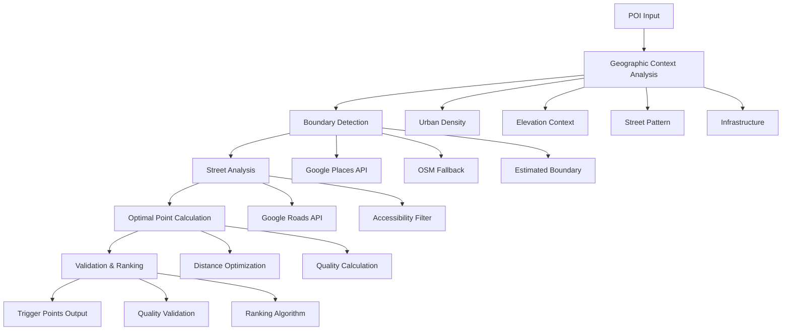

# Arquitetura do Sistema - Trigger Points Google Migration

## 🏗️ Visão Geral da Arquitetura

### Princípios Arquiteturais

1. **Universalidade**: Funciona em qualquer lugar do mundo sem configuração manual
2. **Adaptabilidade**: Se adapta automaticamente ao contexto geográfico
3. **Robustez**: Fallbacks múltiplos para garantir cobertura
4. **Performance**: Otimizado para processamento eficiente
5. **Escalabilidade**: Suporta processamento de milhares de POIs

## 🎯 Componentes Principais

### 1. Core Trigger Point Predictor
```typescript
class CoreTriggerPointPredictor {
  async predictTriggerPoints(poiData: POIData): Promise<TriggerPoint[]>
}
```

**Responsabilidades:**
- Orquestrar todo o processo de geração
- Coordenar entre os diferentes módulos
- Garantir qualidade e validação final

### 2. Geographic Context Analyzer
```typescript
class GeographicContextAnalyzer {
  async analyzeGeographicContext(poiData: POIData): Promise<GeographicContext>
}
```

**Responsabilidades:**
- Analisar densidade urbana automaticamente
- Detectar padrões de ruas
- Calcular contexto de elevação
- Avaliar infraestrutura local

### 3. Boundary Detector
```typescript
class BoundaryDetector {
  async detectBoundary(poiData: POIData, context: GeographicContext): Promise<BoundaryData>
}
```

**Responsabilidades:**
- Detectar boundaries usando Google Places API
- Fallback para OSM quando necessário
- Criar boundaries estimados como último recurso
- Validar qualidade dos boundaries

### 4. Street Analyzer
```typescript
class StreetAnalyzer {
  async findAccessibleStreets(poiData: POIData, boundary: BoundaryData, context: GeographicContext): Promise<StreetData[]>
}
```

**Responsabilidades:**
- Encontrar ruas acessíveis usando Google Roads API
- Filtrar ruas por tipo e acessibilidade
- Calcular pontos mais próximos ao boundary
- Adaptar raio de busca baseado no contexto

### 5. Optimal Point Calculator
```typescript
class OptimalPointCalculator {
  async calculateOptimalPoints(poiData: POIData, streets: StreetData[], boundary: BoundaryData, context: GeographicContext): Promise<TriggerPointCandidate[]>
}
```

**Responsabilidades:**
- Calcular pontos ótimos nas ruas
- Determinar distâncias ideais baseadas no contexto
- Calcular qualidade de cada ponto
- Estimar bearing e visibilidade

### 6. Trigger Point Validator
```typescript
class TriggerPointValidator {
  async validateAndRankPoints(candidates: TriggerPointCandidate[], poiData: POIData, context: GeographicContext): Promise<TriggerPoint[]>
}
```

**Responsabilidades:**
- Validar candidatos a trigger points
- Rankear por qualidade
- Determinar tipos e prioridades
- Aplicar filtros de qualidade

## 🔄 Fluxo de Dados



## 🌍 Estratégias de Fallback

### Hierarquia de Fallbacks

1. **Google Places API** (Primary)
   - Maior precisão
   - Dados mais atualizados
   - Cobertura global

2. **OpenStreetMap** (Secondary)
   - Cobertura complementar
   - Dados gratuitos
   - Fallback robusto

3. **Estimated Boundary** (Tertiary)
   - Baseado em contexto geográfico
   - Algoritmos adaptativos
   - Garantia de funcionamento

### Lógica de Fallback
```typescript
async detectBoundary(poiData: POIData, context: GeographicContext): Promise<BoundaryData> {
  // Estratégia 1: Google Places API
  try {
    const googleBoundary = await this.detectGoogleBoundary(poiData);
    if (googleBoundary && googleBoundary.confidence > 0.7) {
      return { ...googleBoundary, source: 'google_places' };
    }
  } catch (error) {
    console.warn('Google Places boundary detection failed:', error);
  }
  
  // Estratégia 2: OSM Fallback
  try {
    const osmBoundary = await this.detectOSMBoundary(poiData);
    if (osmBoundary && osmBoundary.confidence > 0.5) {
      return { ...osmBoundary, source: 'osm' };
    }
  } catch (error) {
    console.warn('OSM boundary detection failed:', error);
  }
  
  // Estratégia 3: Estimated Boundary
  const estimatedBoundary = await this.createEstimatedBoundary(poiData, context);
  return { ...estimatedBoundary, source: 'estimated' };
}
```

## 📊 Estruturas de Dados

### POI Data
```typescript
interface POIData {
  id: string;
  name: string;
  location: {
    lat: number;
    lng: number;
  };
  type: string;
  country: string;
  city: string;
  state?: string;
}
```

### Geographic Context
```typescript
interface GeographicContext {
  urbanDensity: {
    level: 'very_dense' | 'dense' | 'medium' | 'low' | 'rural';
    score: number;
  };
  elevationContext: {
    type: 'mountainous' | 'hilly' | 'flat';
    variance: number;
  };
  streetPattern: {
    type: 'grid' | 'organic' | 'boulevard' | 'mixed';
    confidence: number;
  };
  infrastructure: {
    transitTypes: string[];
    parkingAvailability: number;
    infrastructureDensity: number;
  };
  region: 'auto_detected';
}
```

### Boundary Data
```typescript
interface BoundaryData {
  coordinates: Array<{lat: number, lng: number}>;
  center: {lat: number, lng: number};
  area: number;
  confidence: number;
  source: 'google_places' | 'osm' | 'estimated';
}
```

### Street Data
```typescript
interface StreetData {
  id: string;
  type: string;
  coordinates: Array<{lat: number, lng: number}>;
  accessibility: string;
  width?: number;
  confidence: number;
}
```

### Trigger Point
```typescript
interface TriggerPoint {
  id: string;
  location: {lat: number, lng: number};
  radius: number;
  expectedBearing: number;
  bearingThreshold: number;
  type: 'primary' | 'secondary' | 'fallback';
  priority: number;
  confidence: number;
  quality: number;
  street: StreetData;
  distance: number;
}
```

## ⚡ Otimizações de Performance

### 1. Caching Strategy
```typescript
class CacheManager {
  // Cache de dados geográficos por 24h
  async getCachedGeographicData(location: GeoPoint): Promise<GeographicContext | null>
  
  // Cache de boundaries por 7 dias
  async getCachedBoundary(poiId: string): Promise<BoundaryData | null>
  
  // Cache de ruas por 1h
  async getCachedStreets(location: GeoPoint, radius: number): Promise<StreetData[] | null>
}
```

### 2. Parallel Processing
```typescript
class ParallelProcessor {
  async processMultiplePOIs(pois: POIData[]): Promise<TriggerPoint[][]> {
    // Processar POIs em paralelo (máximo 5 simultâneos)
    const batches = this.createBatches(pois, 5);
    const results = await Promise.all(
      batches.map(batch => this.processBatch(batch))
    );
    return results.flat();
  }
}
```

### 3. API Rate Limiting
```typescript
class APIRateLimiter {
  private googleAPILimits = {
    places: { requests: 1000, per: 'day' },
    roads: { requests: 1000, per: 'day' },
    streetView: { requests: 1000, per: 'day' },
    elevation: { requests: 1000, per: 'day' }
  };
  
  async checkRateLimit(api: string): Promise<boolean>
  async waitForRateLimit(api: string): Promise<void>
}
```

## 🔒 Tratamento de Erros

### Estratégias de Error Handling

1. **Retry com Exponential Backoff**
```typescript
async retryWithBackoff<T>(operation: () => Promise<T>, maxRetries: number = 3): Promise<T> {
  for (let i = 0; i < maxRetries; i++) {
    try {
      return await operation();
    } catch (error) {
      if (i === maxRetries - 1) throw error;
      await this.sleep(Math.pow(2, i) * 1000);
    }
  }
}
```

2. **Graceful Degradation**
```typescript
async processWithFallback(poiData: POIData): Promise<TriggerPoint[]> {
  try {
    return await this.fullProcessing(poiData);
  } catch (error) {
    console.warn('Full processing failed, using fallback:', error);
    return await this.fallbackProcessing(poiData);
  }
}
```

3. **Error Logging e Monitoring**
```typescript
class ErrorLogger {
  async logError(error: Error, context: any): Promise<void> {
    // Log estruturado para análise
    console.error('Trigger Point Generation Error:', {
      error: error.message,
      stack: error.stack,
      context,
      timestamp: new Date().toISOString()
    });
    
    // Enviar para sistema de monitoramento
    await this.sendToMonitoring(error, context);
  }
}
```

## 📈 Monitoramento e Métricas

### Métricas Principais
```typescript
interface SystemMetrics {
  processingTime: number;
  successRate: number;
  qualityScore: number;
  apiUsage: {
    google: number;
    osm: number;
    fallback: number;
  };
  errorRate: number;
  cacheHitRate: number;
}
```

### Health Checks
```typescript
class HealthChecker {
  async checkSystemHealth(): Promise<HealthStatus> {
    return {
      googleAPIs: await this.checkGoogleAPIs(),
      osmAPI: await this.checkOSMAPI(),
      database: await this.checkDatabase(),
      cache: await this.checkCache(),
      overall: 'healthy' | 'degraded' | 'unhealthy'
    };
  }
}
```

## 🔧 Configuração

### Parâmetros do Sistema
```typescript
const systemConfig = {
  // Distâncias
  maxSearchRadius: 2000,        // metros
  optimalViewingDistance: 100,  // metros
  maxTriggerDistance: 1000,     // metros
  
  // Qualidade
  minTriggerQuality: 0.3,       // 0-1
  minBoundaryConfidence: 0.5,   // 0-1
  
  // Performance
  maxConcurrentPOIs: 5,         // POIs simultâneos
  cacheTTL: {
    geographic: 24 * 60 * 60,   // 24h em segundos
    boundary: 7 * 24 * 60 * 60, // 7 dias em segundos
    streets: 60 * 60            // 1h em segundos
  },
  
  // APIs
  apiTimeouts: {
    google: 10000,              // 10s
    osm: 15000                  // 15s
  }
};
```

Esta arquitetura garante um sistema robusto, escalável e universal que pode processar trigger points em qualquer lugar do mundo com alta qualidade e performance.
