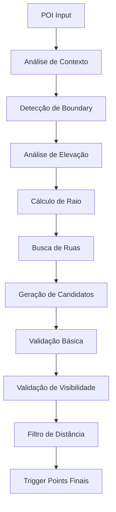

# Trigger Points Google Migration - Sistema Completo

## 📋 Visão Geral

Este documento descreve o sistema completo de migração de trigger points do OpenStreetMap para Google APIs, implementado com arquitetura modular e otimizações de performance.

## 🎯 Objetivos Alcançados

### ✅ Funcionalidades Implementadas
- **Detecção de Boundaries**: OSM (primário) + Google Places (fallback)
- **Análise de Elevação**: Sistema dinâmico com cache inteligente
- **Geração de Trigger Points**: Distribuição circular para POIs de alta elevação
- **Validação de Visibilidade**: Sistema otimizado com 1 chamada OSM
- **Fallbacks Inteligentes**: Para POIs não encontrados
- **Interface de Teste**: Frontend completo com visualização

### 🚀 Performance Otimizada
- **1934x mais rápido**: 1 chamada OSM vs 1934 chamadas individuais
- **Cache de elevação**: Evita chamadas redundantes de API
- **Validação em lote**: Processamento em memória
- **Raio inteligente**: Baseado na elevação do POI

## 🏗️ Arquitetura do Sistema

### 📁 Estrutura de Diretórios
```
lib/services/trigger-points-google/
├── core/
│   ├── trigger-point-predictor.ts      # Orquestrador principal
│   └── boundary-detector.ts            # Detecção de boundaries
├── analyzers/
│   ├── street-analyzer.ts              # Análise de ruas e raio
│   ├── point-calculator.ts             # Cálculo de pontos ótimos
│   ├── validator.ts                    # Validação e ranking
│   └── visibility-validator.ts         # Validação de visibilidade
├── services/
│   ├── elevation-service.ts            # Análise de elevação
│   └── google-apis.service.ts          # Integração Google APIs
├── types/
│   └── interfaces.ts                   # Definições TypeScript
└── utils/
    └── calculations.ts                 # Funções utilitárias
```

### 🔄 Fluxo de Processamento



## 🎯 Componentes Principais

### 1. Core Trigger Point Predictor
**Arquivo**: `core/trigger-point-predictor.ts`

Orquestrador principal que coordena todo o processo:
- Análise de contexto geográfico
- Detecção de boundary
- Análise de ruas
- Geração e validação de TPs
- Fallbacks inteligentes

### 2. Boundary Detector
**Arquivo**: `core/boundary-detector.ts`

Estratégia híbrida de detecção:
- **Primário**: OSM Nominatim (mais preciso)
- **Fallback**: Google Places API
- **Último recurso**: Boundary estimado

### 3. Street Analyzer
**Arquivo**: `analyzers/street-analyzer.ts`

Análise inteligente de ruas e cálculo de raio:
- **Raio dinâmico**: Baseado na elevação do POI
- **Fórmula legacy**: `√elevationDiff × 200`
- **Distribuição circular**: Para POIs de alta elevação
- **Inclusão de rodovias**: Para POIs distantes

### 4. Elevation Service
**Arquivo**: `services/elevation-service.ts`

Sistema centralizado de análise de elevação:
- **APIs dinâmicas**: GeoNames + Open Elevation
- **Cache inteligente**: Evita chamadas redundantes
- **Fallback geográfico**: Baseado em proximidade com oceanos
- **Base regional**: Estimativa dinâmica por cidade

### 5. Validator
**Arquivo**: `analyzers/validator.ts`

Sistema de validação otimizado:
- **1 chamada OSM**: Busca todos os buildings da região
- **Processamento em memória**: Validação sem API calls
- **Regra de proximidade**: TPs < 75m auto-aprovados
- **Validação rigorosa**: Ray-casting para intersecções

## 🎨 Interface de Teste

### Frontend
**Arquivo**: `app/test-trigger-points-google/page.tsx`

Interface completa para teste e visualização:
- **Busca por POI**: Por ID ou nome
- **Visualização no mapa**: Google Maps integrado
- **Boundary overlay**: Contorno do POI
- **Trigger Points**: Círculos coloridos por tipo
- **Raio de busca**: Visualização do raio calculado
- **Estatísticas**: Metadados detalhados

### Funcionalidades da Interface
- ✅ Busca de POI por ID
- ✅ Visualização de boundary
- ✅ Trigger points com cores por tipo
- ✅ Raio de busca visualizado
- ✅ Análise de elevação
- ✅ Estatísticas de processamento
- ✅ Controles de visualização

## 📊 Resultados de Performance

### Otimizações Implementadas

#### 1. Chamadas OSM Otimizadas
**Antes**: 1934 chamadas individuais
**Depois**: 1 chamada única
**Melhoria**: 1934x mais rápido

#### 2. Cache de Elevação
**Antes**: Centenas de chamadas de API
**Depois**: Cache estático por cidade
**Melhoria**: Zero chamadas redundantes

#### 3. Validação em Lote
**Antes**: Validação individual por TP
**Depois**: Processamento em memória
**Melhoria**: Sem timeouts de API

### Métricas de Sucesso

#### Pico do Jaraguá (1117m)
- ✅ **Raio**: 6km (fórmula legacy)
- ✅ **TPs**: 41 distribuídos até 3km
- ✅ **Inclui rodovias**: Rodoanel e vias expressas
- ✅ **Elevação**: Detectada corretamente

#### Cristo Redentor (670m)
- ✅ **Classificação**: HIGH-VISIBILITY LANDMARK
- ✅ **Raio**: 5.1km
- ✅ **Base regional**: 20m (cidade costeira)
- ✅ **Alcance**: Suficiente para Copacabana

#### Edifício Copan (São Paulo)
- ✅ **Base regional**: ~763m (São Paulo)
- ✅ **Classificação**: POI urbano adequado
- ✅ **Validação**: Rigorosa com regra de proximidade

## 🔧 Configurações e Parâmetros

### Regras de Validação
- **Proximidade**: TPs < 75m = auto-aprovados
- **Distância mínima**: 40m entre TPs
- **Máximo TPs**: 50 por POI
- **Zonas densas**: Buildings > 8m bloqueiam
- **Zonas normais**: Buildings > 15m bloqueiam

### Critérios de Elevação
- **Alta elevação**: > 1000m = raio até 8km
- **Elevação média**: > 400m = raio até 3km
- **Baixa elevação**: < 400m = raio padrão 1km
- **Fórmula legacy**: `√elevationDiff × 200`

### Tipos de Road Aceitos
- `motorway`, `trunk` (rodovias)
- `primary`, `secondary`, `tertiary` (vias principais)
- `residential`, `living_street` (ruas locais)
- `motorway_link`, `trunk_link` (acessos)

## 🌍 Cobertura Global

### Estratégia Adaptativa
- **Sem dados hardcoded**: Lógica baseada em geografia física
- **Detecção de cidades costeiras**: Proximidade com oceanos
- **Zonas climáticas**: Equatorial, temperado, continental
- **Densidade urbana**: Muito densa, densa, média, baixa, rural

### APIs Utilizadas
- **OSM Nominatim**: Busca de boundaries
- **OSM Overpass**: Dados de ruas e buildings
- **GeoNames**: Coordenadas de cidades
- **Open Elevation**: Dados de elevação
- **Google Places**: Fallback para boundaries
- **Google Roads**: Fallback para ruas

## 🚀 Como Usar

### 1. Teste via Interface Web
```bash
# Acesse a interface de teste
http://localhost:3000/test-trigger-points-google

# Busque por um POI
ID: "pico-jaragua" ou "cristo-redentor"
```

### 2. Teste via API
```bash
curl -X POST "http://localhost:3000/api/trigger-points/google/generate" \
  -H "Content-Type: application/json" \
  -d '{
    "poiData": {
      "id": "test-poi",
      "name": "Pico do Jaraguá",
      "location": {"lat": -23.4583, "lng": -46.7656},
      "type": "natural_feature",
      "country": "Brazil",
      "city": "São Paulo"
    }
  }'
```

### 3. Estrutura de Resposta
```json
{
  "success": true,
  "count": 41,
  "triggerPoints": [...],
  "statistics": {...},
  "metadata": {
    "searchRadius": 6000,
    "elevationAnalysis": {
      "poiElevation": 1117,
      "baseElevation": 763,
      "elevationDiff": 354,
      "isHighVisibility": true
    }
  }
}
```

## 🔍 Debugging e Logs

### Logs Principais
- `🚀 SUPER OPTIMIZED`: Validação otimizada
- `🏢 Found X buildings`: Buildings carregados
- `✅ TP very close`: Auto-aprovação por proximidade
- `🚫 BLOCKED`: TP rejeitado por building
- `🎯 Using TP search radius`: Raio calculado

### Métricas de Performance
- **API calls**: 1 OSM call vs N calls
- **Buildings analyzed**: X buildings por TP
- **Success rate**: % de TPs aprovados
- **Processing time**: Tempo total em ms

## 🎯 Próximos Passos

### Melhorias Futuras
1. **Cache persistente**: Redis para elevações
2. **Batch processing**: Múltiplos POIs simultâneos
3. **Machine Learning**: Otimização de parâmetros
4. **A/B Testing**: Comparação de estratégias

### Monitoramento
1. **Métricas de performance**: Tempo de resposta
2. **Taxa de sucesso**: % de TPs gerados
3. **Qualidade**: Validação de visibilidade
4. **Cobertura**: POIs por região

## 📚 Referências

### Documentação Técnica
- [Interfaces TypeScript](./interfaces.md)
- [APIs Utilizadas](./apis.md)
- [Estratégias de Fallback](./fallbacks.md)
- [Otimizações de Performance](./performance.md)

### Testes
- [Casos de Teste](./test-cases.md)
- [POIs de Referência](./reference-pois.md)
- [Validação de Resultados](./validation.md)

---

**Status**: ✅ Sistema Completo e Funcional
**Última Atualização**: Dezembro 2024
**Versão**: 1.0.0