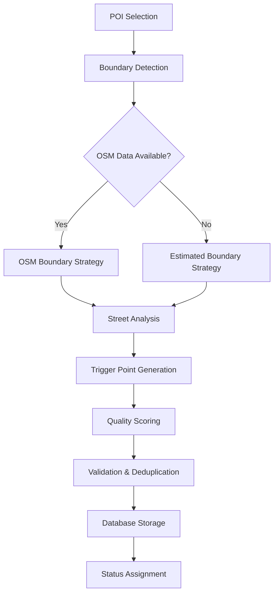

# Trigger Points - Overview & Concepts

## 🎯 Core Concept

Trigger points are strategic geographic locations where users passing through will hear descriptive audio about nearby POIs (Points of Interest). The system automatically determines the best locations for these triggers based on:

- **Accessibility**: Where users can naturally drive or walk
- **Visibility**: Optimal viewing angles and distances to the POI
- **Safety**: Avoiding dangerous or restricted areas
- **User Experience**: Providing audio at the most relevant moments

## 📍 Types of Trigger Points

### Primary Trigger Points
- **Purpose**: Main activation points with best POI visibility
- **Priority**: 1 (highest)
- **Radius**: 20-50 meters
- **Usage**: Primary audio content delivery

### Secondary Trigger Points
- **Purpose**: Alternative viewpoints or approach routes
- **Priority**: 2
- **Radius**: 20-40 meters
- **Usage**: Supplementary or directional audio

### Fallback Trigger Points
- **Purpose**: Backup activation when primary/secondary unavailable
- **Priority**: 3
- **Radius**: 30-100 meters
- **Usage**: Basic POI notification

## 🌍 Generation Strategies

### 1. Boundary-Based Strategy (Preferred)
**When**: POI found in OpenStreetMap with defined boundaries
**Process**:
1. Extract POI boundary from OSM
2. Analyze nearby streets within buffer zone
3. Calculate optimal trigger positions on street network
4. Validate accessibility and safety

**Advantages**: High accuracy, real boundary data, optimal positioning

### 2. Estimated Boundary Strategy (Fallback)
**When**: POI not found in OpenStreetMap
**Process**:
1. Create estimated circular boundary around POI coordinates
2. Size boundary based on POI type and urban density
3. Find nearby streets using Overpass API
4. Generate triggers on accessible street segments

**Advantages**: Works for all POIs, reasonable accuracy

## 🏗️ Quality Scoring System

### Confidence Score (0.0 - 1.0)
Calculated based on multiple factors:

#### Boundary Quality (40% weight)
- **OSM Boundary**: 0.9-1.0 (high confidence)
- **Estimated Boundary**: 0.3-0.7 (medium confidence)

#### Data Source Bonus (20% weight)
- **OSM Nominatim**: +0.15
- **OSM Overpass**: +0.10
- **Estimated**: +0.05

#### Trigger Points Quality (30% weight)
- **Street Confidence**: Based on road type and accessibility
- **Distance Optimization**: Closer to optimal viewing distance
- **Coverage**: How well triggers cover the POI area

#### Visibility Factors (10% weight)
- **POI Height**: Taller buildings get higher visibility scores
- **Urban Density**: Considers surrounding building heights
- **Landmark Status**: UNESCO/Heritage sites get bonus points

### Automatic Status Assignment

| Confidence Score | Auto Status | Description |
|------------------|-------------|-------------|
| ≥ 0.75 | `approved` | High quality, ready for production |
| 0.50 - 0.74 | `review` | Good quality, needs manual review |
| < 0.50 | `rejected` | Low quality, needs improvement |

## 🎚️ Processing Types

### 1. Without Trigger Points
- **Target**: POIs that have zero trigger points
- **Use Case**: Initial trigger point generation
- **Priority**: High (enables new POIs)

### 2. Few Trigger Points (<3)
- **Target**: POIs with 1-2 trigger points
- **Use Case**: Improve coverage for existing POIs
- **Priority**: Medium (enhancement)

### 3. All Approved POIs
- **Target**: All POIs regardless of current trigger point count
- **Use Case**: System-wide regeneration or updates
- **Priority**: Low (maintenance)

### 4. Needs Update
- **Target**: POIs not processed in last 30 days
- **Use Case**: Refresh old or potentially outdated trigger points
- **Priority**: Medium (maintenance)

## 🌐 Geographic Context

### Urban Density Classification
- **Very Dense**: Downtown areas, high-rise districts
- **Dense**: Urban neighborhoods, commercial areas
- **Medium**: Suburban areas, mixed development
- **Low**: Residential areas, small towns
- **Rural**: Countryside, sparse development

### Impact on Trigger Generation
- **Dense Areas**: Smaller trigger radii, more precise positioning
- **Rural Areas**: Larger trigger radii, more flexible positioning
- **Height Thresholds**: Adjusted based on surrounding building density

## 🔄 Processing Flow

## 📊 Key Metrics

### Generation Success Rate
- **Target**: >90% successful generation
- **Measurement**: POIs with at least 1 approved trigger point

### Quality Distribution
- **Target**: >60% auto-approved (≥0.75 confidence)
- **Acceptable**: 30-40% requiring review
- **Concerning**: >10% auto-rejected

### Coverage Metrics
- **Primary Coverage**: % POIs with primary trigger points
- **Geographic Coverage**: Distribution across regions
- **Type Coverage**: Distribution across POI categories

---

## 🔗 Related Documentation

- [Generation Process](./02-generation-process.md) - Detailed technical process
- [Database Schema](./03-database-schema.md) - Data structure
- [Algorithms](./06-algorithms.md) - Mathematical calculations
