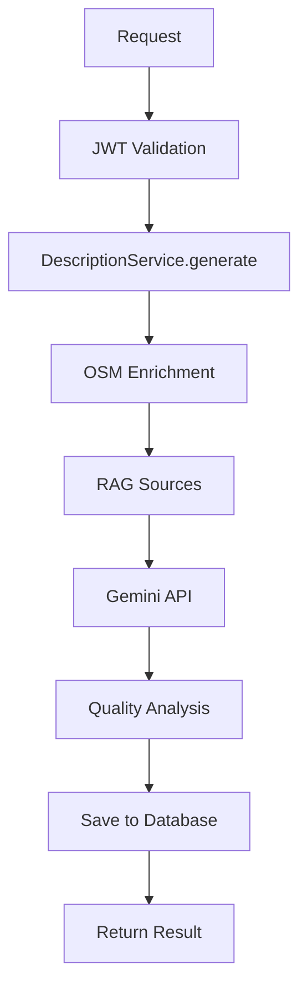
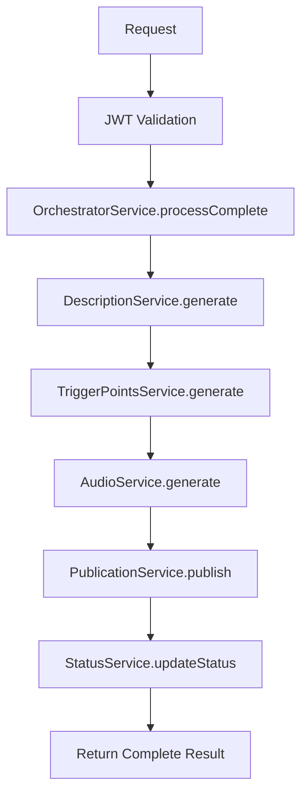
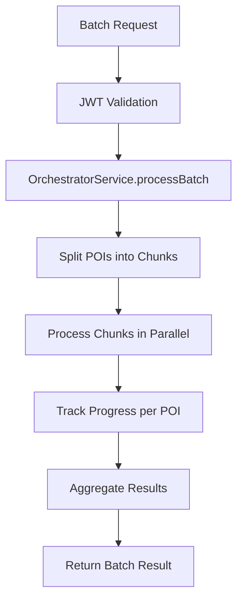

# 🏗️ TECHNICAL ARCHITECTURE: POI AUTOMATION

## 📋 **ARCHITECTURAL VISION**

### **🎯 DESIGN PRINCIPLES**
1. **Modularity**: Each service is independent and reusable
2. **Serverless First**: Edge Functions as execution standard
3. **Single Responsibility**: Each service has a specific responsibility
4. **Dependency Injection**: Services receive dependencies via constructor
5. **Event-Driven**: Asynchronous communication between components
6. **Resilient**: Automatic retry and rollback in case of failure

---

## 🏗️ **LAYERED ARCHITECTURE**

### **📦 SERVICES LAYER (CORE)**
```typescript
// lib/services/poi-processing/
├── description.service.ts      ✅ COMPLETED
├── trigger-points.service.ts   🎯 NEXT
├── audio.service.ts           ⏳ PENDING
├── publication.service.ts     ⏳ PENDING
├── orchestrator.service.ts    ⏳ PENDING
├── status.service.ts         ⏳ PENDING
└── auth.service.ts           ⏳ PENDING
```

### **⚡ EXECUTION LAYER (EDGE FUNCTIONS)**
```typescript
// supabase/functions/
├── generate-description/      ✅ DEPLOYED
├── process-trigger-points/    🎯 NEXT
├── process-audio/            ⏳ PENDING
├── process-publication/      ⏳ PENDING
├── process-complete/         ⏳ PENDING
└── process-batch/            ⏳ PENDING
```

### **🗄️ DATA LAYER (DATABASE)**
```typescript
// core.attractions (main table)
├── Basic POI data
├── OSM enrichment data
├── RAG sources and content
├── Quality scores and audit
├── Processing status
└── Audit logs

// core.attraction_descriptions (descriptions)
├── attraction_id
├── language
├── gender
├── description
├── verification_status
└── quality_analysis

// core.rag_city_cache (shared cache)
├── Sources by city
├── Processed content
├── Quality scores
└── Cache metadata
```

---

## 🔄 **EXECUTION FLOWS**

### **🎯 INDIVIDUAL FLOW - Description (IMPLEMENTED)**


### **🚀 SEQUENTIAL FLOW - Complete (PLANNED)**


### **📦 BATCH FLOW - Multiple POIs (PLANNED)**


---

## 🔐 **AUTHENTICATION SYSTEM**

### **JWT Token Validation**
```typescript
interface AuthResult {
  success: boolean
  user_id: string
  permissions: string[]
  rate_limit: {
    remaining: number
    reset_time: string
  }
}
```

### **Rate Limiting**
- **Description**: 10 requests/min per user
- **Trigger Points**: 20 requests/min per user
- **Audio**: 5 requests/min per user
- **Batch**: 2 requests/min per user

---

## 📊 **STATUS AND TRACKING SYSTEM**

### **ProcessingResult Interface**
```typescript
interface ProcessingResult<T> {
  success: boolean
  data?: T
  error?: string
  processing_time: number
  metadata: {
    step: string
    model_used?: string
    tokens_consumed?: number
    quality_score?: number
    progress?: number
    status: 'pending' | 'processing' | 'completed' | 'failed'
    user_id?: string
    request_id?: string
    timestamp: string
  }
}
```

### **Status Tracking**
- **Real-time**: WebSocket for real-time updates
- **Progress**: Completion percentage per stage
- **History**: Complete processing log
- **Rollback**: Ability to reverse changes

---

## 🔄 **RETRY AND RESILIENCE SYSTEM**

### **Retry Strategy**
```typescript
interface RetryConfig {
  max_attempts: number
  backoff_multiplier: number
  initial_delay: number
  max_delay: number
}
```

### **Fallback Mechanisms**
- **API Failures**: Retry with exponential backoff
- **Timeout**: Asynchronous processing via jobs
- **Partial Failures**: Incremental saving
- **Rollback**: Automatic reversal in case of failure

---

## 📈 **MONITORING AND OBSERVABILITY**

### **Collected Metrics**
- **Performance**: Processing time per stage
- **Quality**: Quality scores of descriptions
- **Usage**: Number of requests per service
- **Errors**: Error rate and failure types
- **Resources**: Token usage and API calls

### **Automatic Alerts**
- **High Error Rate**: >5% failures
- **Slow Response**: >8 seconds processing
- **API Limits**: Approaching rate limits
- **Quality Drop**: Average score <70

---

## 🧪 **TESTING STRATEGY**

### **Unit Tests**
- **Services**: Isolated tests of each service
- **Edge Functions**: Local tests with Deno
- **Interfaces**: TypeScript type validation

### **Integration Tests**
- **Database**: Persistence tests
- **External APIs**: Integration tests with Google APIs
- **Authentication**: JWT and permission tests

### **Load Tests**
- **Concurrent Users**: Up to 100 simultaneous users
- **Batch Processing**: Up to 1000 POIs in batch
- **Edge Function Limits**: 10 second timeout

---

## 🚀 **DEPLOY AND VERSIONING**

### **Edge Functions**
- **Local Development**: `supabase functions serve`
- **Testing**: `supabase functions deploy --no-verify-jwt`
- **Production**: `supabase functions deploy`

### **Versioning**
- **Semantic Versioning**: MAJOR.MINOR.PATCH
- **Database Migrations**: Versioned and reversible
- **API Compatibility**: Backward compatibility guaranteed

---

## 🔒 **SECURITY AND CONFIGURATION**

### **Environment Variables**
```bash
# Supabase
SUPABASE_URL=your_project_url
SUPABASE_SERVICE_ROLE_KEY=your_service_role_key

# Google APIs
GOOGLE_GEMINI_API_KEY=your_gemini_key
GOOGLE_TTS_CREDENTIALS=your_tts_credentials

# Rate Limiting
RATE_LIMIT_WINDOW_MS=60000
MAX_REQUESTS_PER_WINDOW=100
```

### **Security Measures**
- **JWT Validation**: Signed and validated tokens
- **Rate Limiting**: Abuse prevention
- **Input Validation**: Data sanitization
- **SQL Injection**: Prepared statements
- **CORS**: Restrictive configuration

---

## 📚 **RELATED DOCUMENTATION**

- **[🏠 Main README](./README.md)** - Project overview
- **[📚 Documentation Index](./DOCUMENTATION_INDEX.md)** - Quick navigation
- **[🗺️ Implementation Roadmap](./IMPLEMENTATION_ROADMAP.md)** - Complete roadmap

---

**🏗️ TECHNICAL ARCHITECTURE COMPLETE!**  
**Solid foundation for implementing the next modular services**
